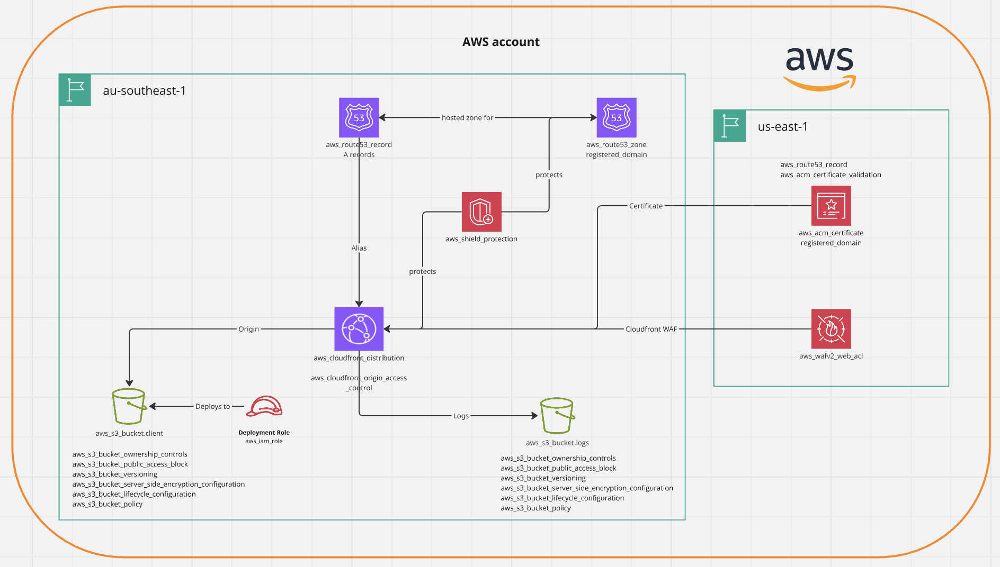

# cloudfront-spa-infra

This module is designed to provision all resources required for a static S3 hosted single-page application using AWS Cloudfront and S3

NOTE: This IaC will incur ongoing costs when deployed for over 24 hours on top of the costs of a registered domain. Fees generally range from $9 to over $100 per year for popular extensions (e.g. `.com` or `.org`)

This is an example of a more productionised static website hosted in cloud infrastructure.

Traffic to and from the website uses `https` and is therefore encrypted with ACME certificates managed through the Automated Certificate Management Environment (ACME) protocol, which AWS Certificate Manager (ACM) can integrate with for public or private certificate services. ACME is a standard protocol designed by the Internet Security Research Group (ISRG) for automating the issuance and renewal of digital certificates, commonly used by services like Let's Encrypt. 

A custom domain can be utilized by registering for a domain.

AWS CloudFront is a global Content Delivery Network (CDN) service that accelerates the delivery of web content, applications, and APIs to users worldwide with low latency and high data transfer speeds. It works by caching content at globally distributed "edge locations," so content is served from a location closer to the user, reducing delays and improving performance for static, dynamic, and streaming content. 

AWS WAF (Web Application Firewall) is a cloud-based service that protects the website from common web exploits and bots, such as SQL injection and cross-site scripting (XSS) and DDoS attacks. It works by allowing you to create custom security rules that filter web requests based on conditions like IP addresses, HTTP headers, or request rate. You can also use pre-configured rules, like Managed Rules, for OWASP Top 10 risks and bot protection.

AWS Simple Storage Service (Amazon S3) is used as an object storage service offered by Amazon Web Services (AWS) for the spa website. It provides a highly scalable, durable, and available solution for storing and retrieving any amount of data from anywhere on the web. 

## Architecture



## Pre-requisites

A registered domain is required for the proper functioning of this code.

Domains can be [registered with Route53](https://docs.aws.amazon.com/Route53/latest/DeveloperGuide/domain-register.html#domain-register-procedure-section) if using AWS and often requires a 12 month commitment and will incur a [cost](https://aws.amazon.com/route53/pricing/#topic-0).

Once the domain name registration is complete, AWS automatically makes Route 53 the DNS service for the domain. Route 53 creates a hosted zone that has the same name as the domain, assigns four name servers to the hosted zone, and updates the domain to use those name servers.

## Provisioning Infrastructure

To provision the infrastructure required, use the IaC tool Terraform.

1. Update the `registered_domain` variable in the `tfvars/env.tfvars` file of this directory to the registered domain purchased in the pre-requisite instructions.
2. In a terminal of choice, navigate to the directory `cdn-s3-spa`.
3. Export the following AWS credentials into your console:

```bash
export AWS_ACCESS_KEY_ID=<access_key_id_from_account>
export AWS_SECRET_ACCESS_KEY=<access_secret_access_key_from_account>
export AWS_SESSION_TOKEN=<access_session_token_from_account>
export AWS_REGION=ap-southeast-1
```

4. Run the following terraform commands in your terminal:

```terraform
$ terraform init      # Initializes the terraform workspace (currently uses a local backend)  
$ terraform plan      # Presents a plan of the resources that will be deployed
$ terraform apply     # Deploys the workspace infrastructure
```

## Cleaning up

The bring down the provisioned infrastructure and incur not more costs:

2. In a terminal of choice, navigate to the directory `cdn-s3-spa`. Ensure your `terraform.tfstate` file is present on your machine (this file gets generated after running a terraform apply locally).
3. Run the following terraform commands in your terminal:

```terraform
$ terraform init      # Initializes the terraform workspace (currently uses a local backend) 
$ terraform destroy   # Destroys all resources deployed in the entire workspace 
```