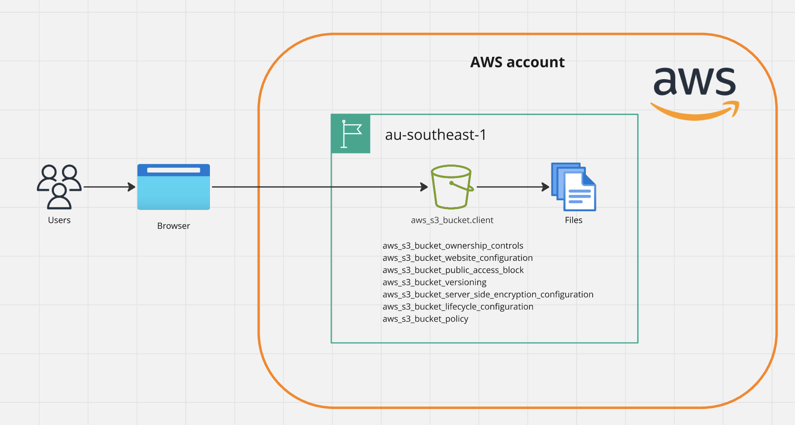

# s3-spa-infra

This module is designed to provision all resources required for a static S3 hosted single-page application using AWS S3 only.

This is an example of a very basic static website hosted in cloud infrastructure.

Traffic to and from the website uses `http` and is therefore not-encrypted so should not be used in production environments.

AWS Simple Storage Service (Amazon S3) is used as an object storage service offered by Amazon Web Services (AWS) for the spa website. It provides a highly scalable, durable, and available solution for storing and retrieving any amount of data from anywhere on the web. 

NOTE: This IaC will incur ongoing costs if kept deployed over 24 hours. To ensure no costs are incurred run the clean up instructions below. 

## Architecture



## Pre-requisites

Select an AWS domain to provision your resources. By default the `ap-southeast-2` is selected.

## Provisioning Infrastructure

To provision the infrastructure required, use the IaC tool Terraform.

1. In a terminal of choice, navigate to the directory `s3-spa`.
2. Export the following AWS credentials into your console:

```bash
export AWS_ACCESS_KEY_ID=<access_key_id_from_account>
export AWS_SECRET_ACCESS_KEY=<access_secret_access_key_from_account>
export AWS_SESSION_TOKEN=<access_session_token_from_account>
export AWS_REGION=ap-southeast-1
```

3. Run the following terraform commands in your terminal:

```terraform
$ terraform init      # Initializes the terraform workspace (currently uses a local backend)  
$ terraform plan      # Presents a plan of the resources that will be deployed
$ terraform apply     # Deploys the workspace infrastructure
```

3. View the output `website_endpoint`, copy and paste the value into a web browser to view the static website.

## Cleaning up

The bring down the provisioned infrastructure and incur not more costs:

2. In a terminal of choice, navigate to the directory `s3-spa`. Ensure your `terraform.tfstate` file is present on your machine (this file gets generated after running a terraform apply locally).
3. Run the following terraform commands in your terminal:

```terraform
$ terraform init      # Initializes the terraform workspace (currently uses a local backend) 
$ terraform destroy   # Destroys all resources deployed in the entire workspace 
```